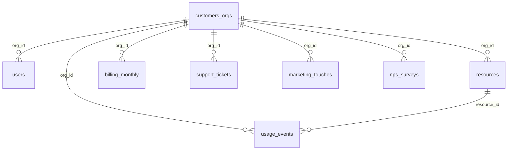

# Diccionario de datos · Cloud Provider Analytics

Inventario, estructura y calidad de las fuentes provistas (`datalake/landing/`), con los tratamientos definidos para el diseño. Los números corresponden a la muestra del caso.

Convenciones:
- **Tipo origen → objetivo:** cómo llega el dato y cómo se guarda desde Bronze.
- **Marcar:** el registro sigue en el flujo con una columna que indica el problema.
- **Cuarentena:** el registro se separa en `silver/quarantine/` para revisión. Nada se borra.

---

## 1. Inventario

| Fuente | Una fila es… | Clave | Filas | Llegada |
|---|---|---|---:|---|
| `customers_orgs.csv` | una organización cliente | `org_id` | 80 | Batch diario |
| `users.csv` | un usuario de una organización | `user_id` | 800 | Batch diario |
| `resources.csv` | un recurso alquilado | `resource_id` | 400 | Batch diario |
| `billing_monthly.csv` | la factura de un cliente por mes | `invoice_id` (también `org_id + month`) | 240 | Batch diario (cierres de ciclo) |
| `support_tickets.csv` | un reclamo de soporte | `ticket_id` | 1.000 | Batch diario |
| `marketing_touches.csv` | un contacto de campaña | `touch_id` | 1.500 | Batch diario |
| `nps_surveys.csv` | una encuesta NPS | `org_id + survey_date` | 92 | Batch diario |
| `usage_events_stream/*.jsonl` | un evento de uso de un recurso | `event_id` | 43.200 (120 archivos) | Streaming |

Todas las fechas llegan como texto (`AAAA-MM-DD`; los eventos en ISO-8601 UTC, por ejemplo `2025-08-17T01:55:00Z`) y todas son fechas válidas.

## 2. Relaciones

`customers_orgs` es el centro del modelo: todas las fuentes se conectan con ella por `org_id`, y los eventos además con `resources` por `resource_id`. No hay registros huérfanos, y el recurso de cada evento siempre pertenece al mismo cliente y servicio que informa el evento.

| Relación | Cobertura |
|---|---|
| `users` → clientes | Todos los clientes tienen usuarios (3 a 19, promedio 10) |
| `resources` → clientes | Todos tienen recursos (1 a 11, promedio 5) |
| `billing_monthly` → clientes | Todos tienen exactamente 3 facturas |
| `support_tickets` → clientes | Todos tienen tickets |
| `marketing_touches` → clientes | Todos recibieron contactos |
| `nps_surveys` → clientes | 60 de 80 tienen encuestas (28 con una, 32 con dos) |
| `usage_events` → clientes y recursos | Integridad completa |

---

## 3. Diccionario por fuente

### 3.1 `customers_orgs.csv`

| Campo | Tipo | Descripción y valores | Problema → tratamiento |
|---|---|---|---|
| `org_id` | string | ID del cliente (`org_` + 8 caracteres) | — |
| `org_name` | string | Nombre; termina con un número de fila ("Nimbus Labs 0") | No sirve como identificador |
| `industry` | string | 10 rubros (Education, Media, Manufacturing, E-commerce, Retail, Healthcare, Energy, Fintech, Gaming, Government) | — |
| `hq_region` | string | Región de la sede: 7 códigos (`sa-east`, `us-east`, `us-west`, `eu-central`, `eu-west`, `ap-south`, `ap-northeast`) | — |
| `plan_tier` | string | Plan: free, standard, pro, enterprise | Ver `is_enterprise` |
| `is_enterprise` | boolean | Indicador enterprise | No coincide con `plan_tier`: de 10 planes enterprise, solo 1 tiene `True`; 16 `True` en otros planes → supuesto: miden cosas distintas (tamaño de empresa vs. plan) |
| `signup_date` | string → date | Fecha de alta (04/05/2025 a 02/07/2025) | — |
| `sales_rep` | string | Vendedor: `rep_a` a `rep_e` | — |
| `lifecycle_stage` | string | lead, prospect, active, at_risk, churned | — |
| `marketing_source` | string | partner, event, organic, ads, referral | — |
| `nps_score` | float → int | NPS de la organización (−100 a 100) | 11 vacíos (permitidos); 1 valor fuera de rango (101) → marcar. No coincide con `nps_surveys` → supuesto: la fuente de NPS es `nps_surveys` |

### 3.2 `users.csv`

| Campo | Tipo | Descripción y valores | Problema → tratamiento |
|---|---|---|---|
| `user_id` | string | ID del usuario (`user_` + 8 caracteres) | — |
| `org_id` | string | Cliente al que pertenece | — |
| `email` | string | `user_xxx@example.com` (dato personal) | Retención y anonimización según gobierno |
| `role` | string | admin, developer, devops, data_engineer, ml_engineer, analyst | — |
| `active` | boolean | Usuario activo (728 de 800) | — |
| `created_at` | string → date | Creación (04/05/2025 a 11/08/2025) | Ver sección 4 |
| `last_login` | string → date | Último ingreso (14/05/2025 a 31/08/2025) | 139 vacíos (nunca ingresaron, permitido); ver sección 4 |

### 3.3 `resources.csv`

| Campo | Tipo | Descripción y valores | Problema → tratamiento |
|---|---|---|---|
| `resource_id` | string | ID del recurso (`res_` + 8 caracteres) | — |
| `org_id` | string | Cliente dueño | — |
| `service` | string | compute, storage, database, networking, analytics, genai | — |
| `region` | string | Centro de datos donde corre (mismos 7 códigos; no es la sede) | — |
| `created_at` | string → date | Creación (04/05/2025 a 21/08/2025) | Ver sección 4 |
| `state` | string | running (242), stopped (119), terminated (39) | — |
| `tags_json` | string → lista | Etiquetas: `env` (prod/dev), `team` (core/ml), `costcenter` (alpha/beta), `pii:true`, `backup:daily` | 83 vacíos (permitido); se guarda crudo en Bronze y se desarma en Silver. `pii:true` marca datos personales |

### 3.4 `billing_monthly.csv`

| Campo | Tipo | Descripción y valores | Problema → tratamiento |
|---|---|---|---|
| `invoice_id` | string | ID de la factura (`inv_` + 8 caracteres) | — |
| `org_id` | string | Cliente facturado | — |
| `month` | string → date | Mes facturado, siempre día 1 (06, 07 y 08/2025) | Supuesto: todos cierran a fin de mes calendario |
| `subtotal` | double | Monto antes de impuestos (−1.671,83 a 2.237,39) | 13 negativos con impuesto positivo (error de signo probable) → marcar |
| `credits` | double | Descuentos a favor (0 a 79,06) | 137 vacíos → completar con 0 |
| `taxes` | double | 21 % del subtotal (en valor absoluto) | — |
| `currency` | string | USD (160), ARS (51), EUR (29) | Un cliente puede cambiar de moneda entre meses |
| `exchange_rate_to_usd` | double | USD por unidad de moneda | En USD varía entre 0,85 y 1,12 → usar 1 y marcar. No está confirmado si los montos están en la moneda indicada o ya en USD (decisión abierta) |

### 3.5 `support_tickets.csv`

| Campo | Tipo | Descripción y valores | Problema → tratamiento |
|---|---|---|---|
| `ticket_id` | string | ID del ticket (`tkt_` + 8 caracteres) | — |
| `org_id` | string | Cliente que reclamó | — |
| `category` | string | performance, security, availability, usability, integration, billing | — |
| `severity` | string | low, medium, high, critical | — |
| `created_at` | string → date | Apertura (09/05/2025 a 31/08/2025) | Ver sección 4 |
| `resolved_at` | string → date | Resolución (10/05/2025 a 19/09/2025) | 240 vacíos (tickets abiertos, permitido) |
| `csat` | float → int | Satisfacción con la atención (escala 1 a 5) | 254 vacíos; 40 fuera de escala (0, 6, 7) → marcar y excluir de promedios; 172 tickets abiertos con CSAT → marcar |
| `sla_breached` | boolean | Plazo incumplido (95 casos) | No se relaciona con el tiempo de resolución y no hay umbrales por gravedad → se usa el dato tal como llega |

### 3.6 `marketing_touches.csv`

| Campo | Tipo | Descripción y valores | Problema → tratamiento |
|---|---|---|---|
| `touch_id` | string | ID del contacto (`mkt_` + 8 caracteres) | — |
| `org_id` | string | Organización contactada | — |
| `campaign` | string | welcome, genai_launch, security_week, webinar_finops, upgrade_pro, upgrade_enterprise | — |
| `channel` | string | email, ads, event, in_app | — |
| `timestamp` | string → date | Fecha del contacto (sin hora, pese al nombre) | — |
| `clicked` | boolean | Hubo clic (453, 30 %) | — |
| `converted` | boolean | Terminó en la acción buscada (144, 9,6 %) | 96 conversiones sin clic; tasas iguales en todas las campañas y canales → limitación para comparar campañas |

### 3.7 `nps_surveys.csv`

| Campo | Tipo | Descripción y valores | Problema → tratamiento |
|---|---|---|---|
| `org_id` | string | Cliente que respondió | — |
| `survey_date` | string → date | Fecha de la encuesta | Ver sección 4 |
| `nps_score` | float → int | NPS de la encuesta (−16 a 68) | 19 vacíos (permitido) |
| `comment` | string | 6 categorías fijas: Missing features, Love genAI features, Complex billing, Stable but slow, Too expensive, Great support | 10 vacíos (permitido) |

### 3.8 `usage_events_stream/*.jsonl`

| Campo | Tipo | Descripción y valores | Problema → tratamiento |
|---|---|---|---|
| `event_id` | string | ID del evento | Sin duplicados en la muestra; igual se deduplica (un archivo puede leerse dos veces) |
| `timestamp` | string → timestamp UTC | Fecha y hora (03/07/2025 a 31/08/2025, 720 eventos por día) | Corte del día: UTC u hora local (decisión abierta) |
| `org_id` | string | Cliente | — |
| `resource_id` | string | Recurso que generó el evento | — |
| `service` | string | 6 servicios (iguales a `resources`) | — |
| `region` | string | Región del recurso | — |
| `metric` | string | requests, cpu_hours, storage_gb_hours | Todos los servicios registran las tres métricas: característica del dataset |
| `value` | mixto → double | Cantidad medida | 1.309 llegan como texto (todos convertibles) → convertir; 877 vacíos |
| `unit` | string | count, hours, gb_hours (siempre coincide con la métrica) | 2.038 con `value` y sin `unit` → completar según la métrica y marcar; 37 sin `value` ni `unit` → cuarentena |
| `cost_usd_increment` | double | Costo del evento en USD | 216 negativos (mín. −154,46) y picos (máx. 317,43; el 75 % cuesta menos de 6,12) → marcar como anomalía |
| `schema_version` | int | 1 o 2 | — |
| `carbon_kg` | double | Carbono generado | Solo existe en v2 → vacío en v1 |
| `genai_tokens` | long | Tokens de IA | Solo en servicio `genai` y v2 (3.132 eventos) |

**Evolución de esquema**

| Versión | Período | Eventos | Diferencia |
|---|---|---:|---|
| 1 | 03/07 al 17/07/2025 | 10.800 | Sin `carbon_kg` ni `genai_tokens` (la clave no existe) |
| 2 | 18/07 al 31/08/2025 | 32.400 | Agrega `carbon_kg` en todos y `genai_tokens` en `genai` |

---

## 4. Consistencia de fechas entre tablas

| Cruce | Casos | % |
|---|---:|---:|
| Usuarios creados antes del alta del cliente | 249 | 31 % |
| Recursos creados antes del alta del cliente | 119 | 30 % |
| Último ingreso antes de la creación del usuario | 232 | 29 % |
| Tickets anteriores al alta del cliente | 209 | 21 % |
| Eventos anteriores a la creación del recurso | 7.371 | 17 % |
| Encuestas NPS anteriores al alta del cliente | 10 | 11 % |
| Facturas de meses anteriores al alta del cliente | 5 | 2 % |
| Eventos anteriores al alta del cliente | 0 | 0 % |
| Tickets resueltos antes de crearse | 0 | 0 % |

**Conclusión:** el orden de las fechas entre tablas no es confiable; las inconsistencias aparecen en casi todos los cruces con la fecha de alta del cliente y con la de creación de recursos. Las fechas dentro de un mismo registro sí son coherentes (ningún ticket se resuelve antes de crearse). **Tratamiento:** marcar, no descartar. Los contactos de marketing anteriores al alta no se consideran error (marketing contacta prospects).

---

## 5. Reglas de calidad

Se aplican en Silver. Ninguna borra datos.

| ID | Regla | Si no se cumple |
|---|---|---|
| RI-01 | Todo `org_id` existe en `customers_orgs` | Cuarentena |
| RI-02 | Todo `resource_id` de los eventos existe en `resources` y pertenece al mismo `org_id` | Cuarentena |
| EV-01 | `event_id` no vacío y único | Cuarentena (duplicados: se conserva uno) |
| EV-02 | `value` convertible a número | Cuarentena |
| EV-03 | Si hay `value`, hay `unit` | Completar según la métrica y marcar |
| EV-04 | El evento tiene `value` o `unit` | Cuarentena |
| EV-05 | `cost_usd_increment` ≥ −0,01 y sin picos extremos | Marcar como anomalía |
| EV-06 | `genai_tokens` solo en `genai` y v2 | Marcar |
| BI-01 | Subtotal e impuesto con el mismo signo | Marcar |
| BI-02 | `credits` informado | Completar con 0 |
| BI-03 | Tasa 1 para facturas en USD | Usar 1 y marcar |
| TK-01 | `resolved_at` ≥ `created_at` | Cuarentena |
| TK-02 | CSAT entre 1 y 5 | Marcar y excluir de promedios |
| TK-03 | Ticket abierto sin CSAT | Marcar |
| DOM-01 | NPS entre −100 y 100 | Marcar |
| DOM-02 | Categorías dentro de sus valores documentados | Cuarentena |
| TI-01 | Orden de fechas entre tablas (sección 4) | Marcar |

## 6. Supuestos y decisiones abiertas sobre los datos

**Supuestos**
- `credits` vacío significa que no hubo crédito.
- `is_enterprise` (tamaño de empresa) y `plan_tier` (plan contratado) son independientes.
- La fuente de NPS es `nps_surveys`; el `nps_score` de `customers_orgs` es un dato de origen no documentado.
- En la muestra, todos los clientes cierran la facturación a fin de mes calendario.

**Decisiones abiertas**
- Moneda de los montos de facturación: moneda indicada o ya en USD.
- Facturas con subtotal negativo: solo marcar o también corregir el signo.
- Corte del día de los eventos: UTC u hora de Argentina.
- Umbrales de SLA por gravedad (no informados en el dataset).
