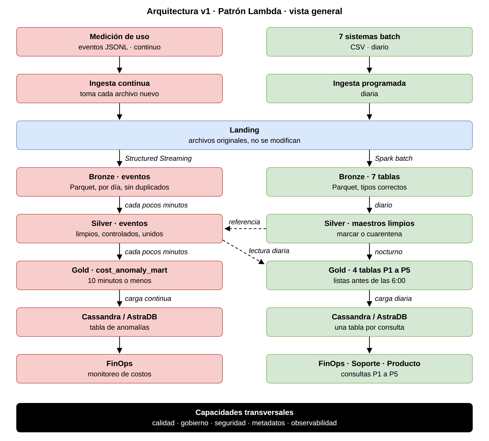
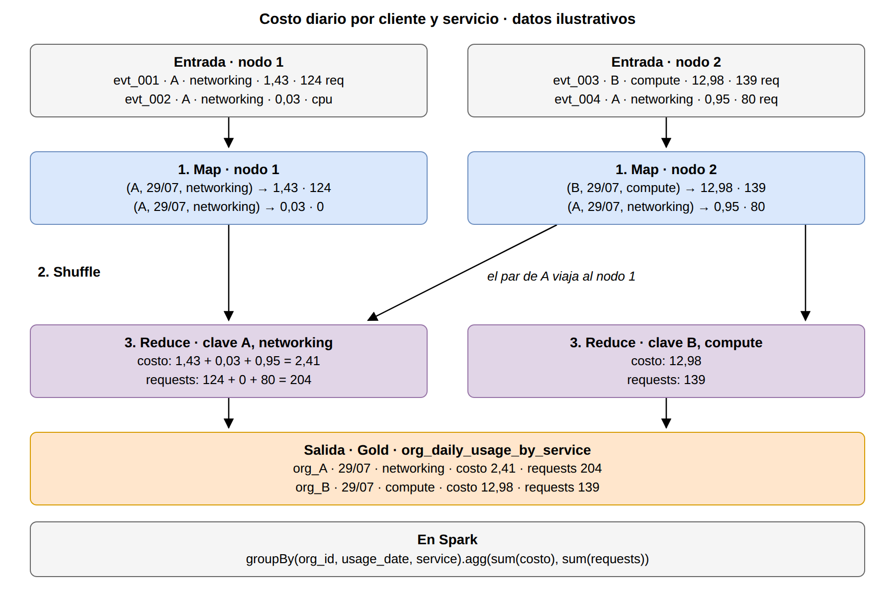

# Cloud Provider Analytics · Documento de diseño v1

| | |
|---|---|
| **Materia** | Minería de Datos II · ISTEA · 2C 2026 |
| **Integrantes** | Alberto Hernán Avalos y Pedro Alves |
| **Estado** | Primera entrega |
| **Repositorio** | [github.com/hernan-av/proyecto-cloud-analytics](https://github.com/hernan-av/proyecto-cloud-analytics) |

> [!IMPORTANT]
> Este documento se complementa con tres archivos que forman parte de la entrega:
> - **Diccionario de datos completo:** [`docs/diccionario_datos.md`](diccionario_datos.md)
> - **Diagrama de arquitectura completo:** [`docs/diagramas/arquitectura_v1_vertical.png`](diagramas/arquitectura_v1_vertical.png)
> - **Registro de decisiones:** [`DECISIONS.md`](../DECISIONS.md)

## Contenido

1. [Interpretación del problema](#1-interpretación-del-problema)
2. [Justificación de Big Data: las 5V](#2-justificación-de-big-data-las-5v)
3. [Inventario y perfil de las fuentes](#3-inventario-y-perfil-de-las-fuentes)
4. [Arquitectura v1](#4-arquitectura-v1)
5. [Patrón de arquitectura: Lambda](#5-patrón-de-arquitectura-lambda)
6. [Matriz requisito-componente](#6-matriz-requisito-componente)
7. [Diseño del Data Lake](#7-diseño-del-data-lake)
8. [Flujos de datos batch y streaming](#8-flujos-de-datos-batch-y-streaming)
9. [Flujo batch de referencia con lógica MapReduce](#9-flujo-batch-de-referencia-con-lógica-mapreduce)
10. [Supuestos, riesgos, mitigaciones y decisiones abiertas](#10-supuestos-riesgos-mitigaciones-y-decisiones-abiertas)
11. [Estimación de esfuerzo, roles y recursos](#11-estimación-de-esfuerzo-roles-y-recursos)
12. [Repositorio, convenciones y evidencia](#12-repositorio-convenciones-y-evidencia)

---

## 1. Interpretación del problema

### 1.1 Contexto del negocio

Somos el área de datos de un proveedor de nube, similar a lo que es Amazon Web Services, Google Cloud, Oracle Cloud o Azure. La empresa no parece tener nombre en el TP, pero el proyecto se llama "Cloud Provider Analytics". Esta empresa se dedica a alquilar infraestructura a otras empresas, que son las organizaciones cliente: almacenamiento, cómputo, bases de datos, red, IA generativa y analítica.

Los archivos del proyecto tienen datos sobre la actividad de la empresa como proveedor, registros de las operaciones y de los clientes, y no se incluyen los datos que los clientes guardan en la nube.

Nuestro trabajo como área de datos es recibir los datos crudos tal cual los genera el sistema, limpiarlos, ordenarlos, unirlos y disponibilizarlos para las áreas que los consumen.

### 1.2 Usuarios y necesidades

Tenemos 3 áreas consumidoras según la consigna:

- **FinOps:** es el área de finanzas y operaciones en la nube y necesita tener información de los costos, los consumos por cliente y servicio, la facturación e información que ayude en la detección de gastos anómalos.
- **Soporte:** esta área necesita datos sobre el volumen y la gravedad de los reclamos, si se cumple con los plazos de resolución y saber cuál es la satisfacción del cliente.
- **Producto:** esta área necesita información del uso de cada servicio, los requests, los tokens de IA generativa y el carbono generado.

### 1.3 Preguntas que deben responderse

En la consigna del TP se indica cuáles son las necesidades a responder (sección 7.4). Nosotros le sumamos además el monitoreo de costos de FinOps, que es la necesidad que termina justificando el camino streaming dentro del diagrama.

| # | Pregunta | Área | Tabla Gold |
|---|---|---|---|
| P1 | Costos y requests diarios por cliente y servicio en un rango de fechas | FinOps | `org_daily_usage_by_service` |
| P2 | Top N servicios por costo acumulado en los últimos 14 días, para una organización | FinOps | `org_daily_usage_by_service` |
| P3 | Evolución de tickets críticos y tasa de SLA incumplido por día, últimos 30 días | Soporte | `tickets_by_org_date` |
| P4 | Revenue mensual con créditos e impuestos, en USD | FinOps | `revenue_by_org_month` |
| P5 | Tokens de IA generativa y costo estimado por día | Producto | `genai_tokens_by_org_date` |
| Monitoreo | Anomalías de costo y gasto del día, con minutos de atraso | FinOps | `cost_anomaly_mart` |

### 1.4 Objetivos medibles y criterios de éxito

| Criterio | Qué asegura | Meta | Cómo se verifica |
|---|---|---|---|
| Monitoreo de costos | FinOps ve los gastos anormales casi en el momento | 10 minutos o menos de atraso | Se calcula la diferencia entre el momento de llegada del evento (`ingest_ts` en Bronze) y la actualización de su fila en `cost_anomaly_mart` |
| Consultas diarias (P1 a P5) | Las áreas arrancan el día con los datos del día anterior | El proceso se hace por la noche; los datos tienen que estar disponibles antes de las 6:00 | Se valida la hora de fin del proceso nocturno, anotada en el registro de ejecución |
| Día completo | Ningún día queda a medias | Como el proceso es por la noche, nos aseguramos de tener los datos de un día completo | Comparar los archivos del registro de Landing con los `source_file` de Bronze; deben pertenecer al mismo día |
| Corte parejo | Todas las tablas deben mostrar el mismo día | La fecha máxima debe ser la misma en las tablas diarias | Verificar la fecha más reciente de todas las tablas de la zona Gold |
| Sin pérdidas | Nada se pierde en el pasaje de datos entre zonas | La diferencia de conteo tiene que ser 0 | Las filas en Bronze tienen que ser iguales a las filas en Silver + cuarentena, por tabla y día |
| Sin duplicados | Ningún evento contado dos veces | No debe existir ID de eventos repetidos | Validar en Silver el conteo de ID de eventos distintos contra la cantidad de filas |
| Números correctos | Lo que ven las áreas coincide con el detalle | Los totales de las zonas Gold y Silver tienen que coincidir | Se valida realizando la suma y comparación de registros entre zonas antes de la carga en Cassandra |
| Calidad conocida | Las áreas saben cuántos datos tenían problemas | Todos los registros deben pasar por las reglas de calidad | Por regla, los datos inconsistentes se marcan y derivan a cuarentena en el ciclo de ejecución |
| Trazabilidad | Cada dato se rastrea hasta su origen | Todas las filas registran su metadata `ingest_ts` y `source_file` | Vacíos en esas columnas en Bronze y Silver |

---

## 2. Justificación de Big Data: las 5V

**Volumen.** Los archivos del TP tienen 43.200 eventos que cubren 60 días, pero en un entorno real con muchísimos clientes, cada recurso de cada cliente registraría su uso y se generarían millones de eventos por día. El volumen en principio justifica que los datos se guarden de forma distribuida, particionados por fecha, y se procesen con Spark. La muestra que tenemos es chica para poder trabajarla en Colab, pero en producción, en un entorno real, tendría muchísimo más volumen.

**Velocidad.** Con el volumen de datos que se manejaría en un entorno real, disponibilizar los datos en 10 minutos o menos para detectar anomalías, que es lo que necesita FinOps, implica un ingreso continuo de muchos datos en poco tiempo. Trabajarlo de forma distribuida permite poder recibir la información en "tiempo real".

**Variedad.** Los datos llegan en CSV y JSONL de 8 sistemas de origen diferentes. Además pueden existir cambios en la estructura de los datos, como las dos versiones de esquema en los eventos: en la segunda parte se agregan los campos `carbon_kg` y `genai_tokens`, que no están en la primera parte de los eventos del JSONL. Las zonas del Data Lake ayudan a ordenar esto definiendo correctamente los tipos en la zona Bronze y realizando la unificación de las dos versiones de los eventos en la zona Silver.

**Veracidad.** Los datos deben ser correctos y tiene que asegurarse la calidad y trazabilidad, porque los datos llegan con errores como los que encontramos en la exploración, donde vimos costos negativos, números como texto, unidades faltantes, calificaciones fuera de escala y fechas fuera de orden entre tablas. Este diseño permite marcar las inconsistencias y/o separarlas sin perder la información original.

**Valor.** Toda la información es imprescindible para poder dar soporte a las áreas usuarias que necesitan responder sus preguntas de negocio y detectar anomalías en tiempo y forma. A la zona Gold llega toda la información limpia y se pasa a tablas de Cassandra para disponibilizársela a las áreas.

---

## 3. Inventario y perfil de las fuentes

> [!IMPORTANT]
> Nosotros definimos armar un diccionario de datos de forma separada, que tiene toda la información de los datos: el diagrama ER de cómo todo se conecta, qué grano tiene cada tabla, qué es cada campo y qué problemas nos encontramos.
>
> **Está disponible acá: [`docs/diccionario_datos.md`](diccionario_datos.md)**

### 3.1 Sistemas de origen

Cada archivo nace de un sistema de la empresa y el área de datos recibe sus exportaciones en Landing.

| Sistema | Quién genera el dato | Archivo | Formato y frecuencia | Camino |
|---|---|---|---|---|
| Medición de uso | Automático: cada servicio registra su consumo | `usage_events_stream/*.jsonl` | JSONL · continuo | Streaming |
| CRM | Vendedores | `customers_orgs.csv` | CSV · diario | Batch |
| Cuentas de usuario | El cliente, desde la consola | `users.csv` | CSV · diario | Batch |
| Inventario de recursos | El cliente, desde la consola | `resources.csv` | CSV · diario | Batch |
| Facturación | Automático, al cierre de cada ciclo | `billing_monthly.csv` | CSV · diario | Batch |
| Mesa de ayuda | Cliente y agentes de soporte | `support_tickets.csv` | CSV · diario | Batch |
| Marketing | Equipo de marketing | `marketing_touches.csv` | CSV · diario | Batch |
| Encuestas | El cliente | `nps_surveys.csv` | CSV · diario | Batch |

*Las frecuencias diarias son supuestos de diseño. La continua de los eventos sale de los datos (120 archivos fragmentados).*

### 3.2 Resumen por fuente

| Fuente | Una fila es… | Tamaño (muestra) | Principales hallazgos |
|---|---|---|---|
| `customers_orgs` | Un cliente | 80 | `nps_score` con 11 vacíos y un valor fuera de rango (101). `is_enterprise` no coincide con `plan_tier`. |
| `users` | Un usuario de un cliente | 800 | `last_login` vacío en 139 (esperable). 29 % con último ingreso anterior a su creación. |
| `resources` | Un recurso alquilado | 400 | `tags_json` es texto con una lista adentro. Etiquetas `pii:true` y `costcenter`. |
| `billing_monthly` | La factura de un cliente por mes | 240 (80 × 3 meses) | 13 subtotales negativos con impuesto positivo. Tasa USD distinta de 1. Moneda de los montos sin aclarar. |
| `support_tickets` | Un reclamo de soporte | 1.000 | 40 CSAT fuera de 1 a 5. 172 tickets abiertos con CSAT. `sla_breached` sin relación con el tiempo de resolución. |
| `marketing_touches` | Un contacto de campaña | 1.500 | Sin vacíos. Tasas de clic y conversión iguales en todas las campañas y canales. |
| `nps_surveys` | Una encuesta NPS | 92 | 19 sin puntaje. El NPS de `customers_orgs` no coincide con estas encuestas. |
| `usage_events` | Un evento de uso con cantidad y costo | 43.200 (120 archivos) | Cambio de esquema el 18/07. 1.309 `value` como texto, 2.038 `value` sin `unit`, 216 costos negativos, picos de hasta 317 USD. |

Todas las fuentes se conectan con `customers_orgs` por `org_id`, sin registros huérfanos; además, los eventos se conectan con `resources` por `resource_id`. Todas las fechas en los archivos llegan como texto.

Algo a tener en cuenta es que el orden de las fechas entre tablas no es confiable: tiene inconsistencias en casi todos los cruces, por ejemplo, el 31 % de los usuarios fueron creados antes del alta de su organización. Pero si miramos dentro de un mismo registro, las fechas sí son consistentes. La tabla completa con los problemas de fecha está en el [diccionario de datos, sección 4](diccionario_datos.md#4-consistencia-de-fechas-entre-tablas).

---

## 4. Arquitectura v1

> [!IMPORTANT]
> Como el diagrama que armamos ocupa mucho, no fue posible sumarlo acá. Mostramos un resumen de los caminos streaming y batch, pero el diagrama completo, con las tablas y reglas de cada zona, se encuentra en:
>
> **[`docs/diagramas/arquitectura_v1_vertical.png`](diagramas/arquitectura_v1_vertical.png)**

El streaming es el camino rojo y el batch el camino verde. Ambos se encuentran en Silver: los datos de los eventos se combinan con la información de los archivos maestros limpios para poder generar la información final y transformada que termina en la zona Gold. Las capacidades transversales (calidad, gobierno, seguridad, metadatos y observabilidad) acompañan todas las zonas.

---

## 5. Patrón de arquitectura: Lambda

Elegimos el patrón Lambda porque nos permite tener un camino batch para la información que se actualiza diariamente, como facturación y tickets, y un camino streaming para los eventos de uso, que tienen que actualizarse en "tiempo real". Son dos necesidades distintas sobre los mismos datos que se abordan con estos dos caminos:

- Las consultas P1 a P5 piden datos por día o por mes. Se resuelven con una actualización diaria, igual que un datawarehouse (este es el camino batch).
- El monitoreo de costos de FinOps necesita detectar consumos anormales mientras ocurren. El uso anómalo que se dispara en un recurso puede significar miles de dólares, por lo que es necesario recibir la información a tiempo (este es el camino streaming).

Los datos llegan entonces de dos formas: por un lado, los datos fragmentados de los eventos, que tienen una llegada continua, y por otro, los datos restantes en exportaciones periódicas. El costo de elegir este patrón es que hay dos caminos de procesamiento que se deben construir y mantener.

**Alternativas descartadas**

| Patrón | Por qué no |
|---|---|
| Batch | No permite el monitoreo de costos con minutos de atraso que pide el negocio. |
| Kappa | Tratar como flujo continuo datos que llegan una vez por día o al cierre de un ciclo agrega complejidad sin beneficio. |
| Híbrido | Lambda ya cubre las dos necesidades; una combinación propia sería más difícil de justificar y mantener. |

---

## 6. Matriz requisito-componente

| Requisito | Origen | Ing. | Land. | Bronze | Silver | Gold | Cass. | Transv. |
|---|---|:-:|:-:|:-:|:-:|:-:|:-:|:-:|
| Métricas de uso y costos casi en tiempo real | Consigna · Velocidad | X | | X | X | X | X | |
| Monitoreo de costos en 10 minutos o menos | Criterio de éxito | | | X | X | X | X | X |
| Maestros y facturación por lotes | Consigna | X | | X | X | | | |
| Datos del día anterior antes de las 6:00 | Criterio de éxito | | | | X | X | X | X |
| Millones de eventos por día | Volumen | | | X | X | X | | |
| CSV, JSONL y dos versiones de esquema | Variedad | | | X | X | | | |
| Datos con errores y valores imposibles | Veracidad | | | | X | | | X |
| Conservar los originales | Consigna · Día completo | | X | | | | | X |
| Sin eventos duplicados | Consigna · Sin duplicados | | | X | X | | | |
| No perder datos y números que cuadren | Criterios de éxito | | | | X | X | | X |
| Rastrear cada dato hasta su archivo | Trazabilidad | | X | X | | | | X |
| Responder P1 a P5 | Consigna 7.4 · Valor | | | | | X | X | |
| Proteger datos personales | Gobierno y seguridad | | X | | | | | X |

- **Ingesta:** continua (eventos) y programada diaria (resto).
- **Bronze, Silver y Gold:** Spark batch y Spark Structured Streaming, en Parquet.
- **Cassandra:** AstraDB, una tabla por consulta.
- **Transversales:** calidad, gobierno, seguridad, metadatos y observabilidad (incluye el registro de ejecución).

---

## 7. Diseño del Data Lake

### 7.1 Zonas

| Zona | Qué contiene | Reglas principales |
|---|---|---|
| Landing | Los archivos tal como llegan | No se modifica nada. Formato original (CSV, JSONL). Registro de cada archivo recibido. |
| Bronze | Las mismas filas, con tipos correctos | Mismo grano que Landing. Tipos fijos (fechas, `value`). Columnas `ingest_ts` y `source_file`. Sin duplicados por `event_id`. Todavía no se limpia. |
| Silver | Datos limpios, controlados y unidos | Aplica las [reglas de calidad del diccionario](diccionario_datos.md#5-reglas-de-calidad): nada se borra, se marca o va a cuarentena (`silver/quarantine/`). Eventos v1 y v2 en una sola tabla. Unión por `org_id` y `resource_id`. Sin SCD. |
| Gold | Tablas resumidas, una por familia de preguntas | Grano explícito. Sale solo de Silver. CSAT solo válidos, tokens solo `genai` v2, revenue en USD. |

### 7.2 Formatos

Landing recibe y conserva los datos en el formato original (CSV y JSONL). Desde la zona Bronze en adelante todo se guarda en el formato que usa Spark: Parquet.

### 7.3 Particiones

Las particiones se definieron en términos de volumen. La realidad es que no todos los datos crecen a la misma velocidad: por ejemplo, la tabla de los eventos y la de los clics de marketing seguramente crezcan mucho más rápido y manejen más volumen, y para esos casos la partición es diaria. Para las tablas que manejan un volumen menor, como la de clientes (no llegan millones de clientes nuevos cada día), de momento se definió no crear particiones.

| Tabla | Muestra | Producción (supuesto) | Partición |
|---|---|---|---|
| `usage_events` | 720 por día | Millones por día | Por día del evento |
| `support_tickets` | ≈ 10 por día | Miles por día | Por fecha de creación |
| `billing_monthly` | 80 por mes | Decenas de miles por mes | Por mes facturado |
| `marketing_touches` | 1.500 en total | Millones | Por fecha |
| `nps_surveys` | 92 | Miles por mes | Por mes (opcional) |
| `customers_orgs` | 80 | Decenas de miles | Sin partición |
| `users` | 800 | Cientos de miles | Sin partición |
| `resources` | 400 | Cientos de miles | Sin partición |

### 7.4 Nombres (naming)

- **Landing:** se organiza en una carpeta por fuente u origen. En las fuentes batch, cada una tiene una subcarpeta por día de llegada (`fecha_carga=AAAA-MM-DD/`). En streaming, como los eventos llegan de a uno todo el tiempo y ya traen su nombre, van todos a `usage_events_stream/`, en archivos numerados por orden de llegada; recién en Bronze los ordenamos por día.
- **Bronze, Silver y Gold:** se organizan en una carpeta por tabla (por ejemplo, `bronze/usage_events/`).
- **Cuarentena:** tendremos una carpeta específica para este caso: `silver/quarantine/`.
- El nombre de las tablas finales va en inglés, igual que las columnas del dataset y los nombres de referencia de la consigna.

### 7.5 Retención

| Zona | Acceso rápido | Después | Por qué |
|---|---|---|---|
| Landing | 12 meses | Archivo, no se elimina | Es la única copia original para reprocesar. |
| Bronze | 12 meses | Archivo | Se puede reconstruir desde Landing, pero tenerlo evita reprocesar todo ante un cambio en Silver. |
| Silver | 24 meses | Archivo | Es la base de todas las tablas de Gold y de cualquier análisis nuevo. |
| Gold | Todo el historial | No aplica | Las tablas son chicas, y comparar contra años anteriores necesita el histórico completo. |
| Cuarentena | 90 días en revisión | Archivo, con el motivo | Tiempo para revisar los casos y decidir qué hacer. |

Nada se elimina por antigüedad. Excepción: los datos personales (emails de `users`, recursos con `pii:true`) se eliminan o anonimizan al cumplirse el plazo legal (Ley 25.326) o a pedido del titular.

### 7.6 Metadatos y trazabilidad

- Registro de cada archivo recibido en Landing: nombre, fecha de llegada y tamaño.
- Columnas `ingest_ts` (cuándo se cargó) y `source_file` (de qué archivo vino) desde Bronze.
- Registro de ejecución de cada proceso: inicio y fin, archivos leídos, filas que entraron, salieron, se marcaron o fueron a cuarentena.
- Columna de última actualización en `cost_anomaly_mart`, para medir el atraso del monitoreo.

Con esto se puede seguir un número de Gold hasta el archivo de Landing de donde salió (linaje).

### 7.7 Reglas de promoción

| De → a | Pasa si… |
|---|---|
| Landing → Bronze | El archivo llegó completo, tiene el formato esperado (CSV o JSONL) y quedó anotado en el registro de llegadas. |
| Bronze → Silver | Se leyó completo y se contaron las filas. |
| Silver → Gold | Se aplicaron todas las reglas de calidad y se registró cuántas filas se marcaron y cuántas fueron a cuarentena. |
| Gold → Cassandra | Los totales coinciden con Silver. |

---

## 8. Flujos de datos batch y streaming

### 8.1 Camino streaming (eventos de uso)

1. Los archivos de los eventos llegan a Landing a medida que se van generando; son de ingesta continua.
2. Luego, Spark Structured Streaming va tomando archivo por archivo y los escribe en Bronze, con los tipos correctos y sin duplicados por ID de evento.
3. En Silver, cada pocos minutos se realiza la limpieza, aplicando las reglas de calidad y uniendo cada evento con los maestros limpios (clientes y recursos).
4. En Gold se actualiza `cost_anomaly_mart` cada pocos minutos y se carga en Cassandra de forma continua para el monitoreo de FinOps.

### 8.2 Camino batch (maestros, facturación, tickets, marketing, NPS)

- Acá tenemos una ingesta programada de forma diaria para la exportación de los archivos a la zona Landing. Una aclaración respecto de la facturación: en los datos figura la fecha de facturación el primer día del mes para todos los clientes, pero es coherente pensar que en un entorno real los clientes tienen distintos ciclos de facturación; por eso acá la ingesta también es diaria y no mensual.
- Spark toma los datos en batch y los escribe en Bronze una vez por día.
- En Silver se realiza la limpieza y se aplican las reglas de calidad. Los archivos maestros limpios quedan como referencia para poder unirlos luego con los eventos.
- En Gold, el proceso nocturno calcula las cuatro tablas de las preguntas de negocio P1 a P5; las de uso (`org_daily_usage_by_service` y `genai_tokens_by_org_date`) leen los eventos enriquecidos de Silver.
- Se cargan en Cassandra una vez por día, antes de las 6:00.

### 8.3 Frecuencias y herramientas

| Tramo | Eventos | Resto de las fuentes |
|---|---|---|
| Ingesta → Landing | Continua | Diaria |
| Landing → Bronze | Spark Structured Streaming | Spark batch, diario |
| Bronze → Silver | Structured Streaming, cada pocos minutos | Spark batch, diario |
| Silver → Gold | Minutos (`cost_anomaly_mart`) y nocturno (P1, P2, P5) | Spark batch, nocturno (P3, P4) |
| Gold → Cassandra | Continua (anomalías) | Diaria |

---

## 9. Flujo batch de referencia con lógica MapReduce

Para la lógica MapReduce elegimos el cálculo del costo y los requests diarios por cliente y servicio, que forman la tabla `org_daily_usage_by_service` de Gold. Es la tabla central para FinOps (responde P1 y P2).

- **Entrada:** inicialmente tenemos los eventos enriquecidos de Silver, repartidos en particiones entre los nodos.
- **1. Map:** cada nodo, sin comunicarse con los demás, convierte cada evento en un par clave → valor. La clave es (cliente, día, servicio), que es el grano de la tabla final. El valor es el costo y la cantidad de requests (los requests valen 0 cuando la métrica no es `requests`).
- **2. Shuffle:** los pares con la misma clave se envían al mismo nodo. Es el único paso en que los datos viajan entre nodos, y por eso el más costoso. En el ejemplo, el evento de org_A que estaba en el nodo 2 viaja al nodo 1.
- **3. Reduce:** cada nodo suma los valores de las claves que recibió y deja una fila por clave.
- **Salida:** la tabla `org_daily_usage_by_service`, con una fila por cliente, día y servicio.

**Correspondencia con Spark.** El mismo cálculo se escribe como `groupBy(org_id, usage_date, service).agg(sum(costo), sum(requests))`. Leer datos de Silver, filtrar y preparar columnas son transformaciones que no generan shuffle: cada nodo trabaja con su partición. Y en el `groupBy` tenemos una suma agrupada, que es la que termina generando el shuffle. La acción se dispara cuando los resultados se tienen que escribir en Gold; hasta ese momento Spark solo tenía armado el plan. O sea, uno de los pasos del proceso entre zonas es una consulta cuyo resultado se guarda en la zona siguiente en vez de mostrarse.

Dos decisiones reducen el costo del shuffle:

- Como los eventos están particionados por día, el proceso nocturno lee solo la carpeta del día que procesa. De ahí la importancia de la partición diaria de los datos en batch, para que el proceso lea solo ese día y no más datos.
- Cada nodo hace una suma parcial de sus propias claves antes del shuffle. Así viaja una fila por clave y por nodo, no un evento por fila.

---

## 10. Supuestos, riesgos, mitigaciones y decisiones abiertas

> [!NOTE]
> Las decisiones tomadas y las que siguen abiertas están registradas en [`DECISIONS.md`](../DECISIONS.md).

### 10.1 Supuestos

- En el caso de negocio, cada archivo es una exportación de un sistema de origen; en el proyecto llegan como archivos a Landing.
- El proyecto corre en Google Colab, es decir, en una sola máquina; pero en un entorno real en producción, el mismo diseño correría en un cluster.
- En la muestra de datos que tenemos, todos los clientes cierran la facturación a fin de mes calendario; en un entorno real es esperable que los clientes tengan diferentes fechas de ciclos de facturación.
- `credits` vacío significa que no hubo crédito (0).
- `is_enterprise` indica el tamaño de la empresa y `plan_tier` el plan contratado; son independientes. Al menos eso se interpreta de los datos, ya que ambos no coinciden.
- La fuente de NPS es `nps_surveys`; el `nps_score` de `customers_orgs` es un dato de origen no documentado, y eso se validó en la exploración de los datos: el NPS en la tabla de clientes no guarda relación con el NPS de la tabla de encuestas.
- Los contactos de marketing anteriores al alta del cliente son esperables (prospects).

### 10.2 Riesgos y mitigaciones

| Riesgo | Qué pasaría | Mitigación |
|---|---|---|
| Cambia el formato de los eventos sin aviso (una versión 3 con columnas nuevas o renombradas) | El camino streaming falla o pierde datos, y FinOps deja de ver los costos | Bronze acepta columnas opcionales; lo que no encaja va a cuarentena y se genera un aviso. Ya pasó una vez en el caso (v1 → v2). |
| El proceso nocturno falla o hay que repetirlo | A las 6:00 las áreas no tienen los datos, o los costos aparecen sumados dos veces | El proceso reescribe el día completo en vez de agregar filas; el registro de ejecución avisa si falla o se atrasa; se puede reprocesar desde Landing. |
| El camino streaming se atrasa o se cae (un pico de eventos o archivos que llegan tarde) | Una anomalía de costo no se detecta a tiempo | Aviso cuando el atraso supera los 10 minutos; los eventos que llegan tarde igual entran en el proceso nocturno, así que el dato diario queda completo. |
| Los dos caminos dan números distintos | FinOps no sabe qué número creer | El número oficial es el del proceso nocturno; al cierre del día se comparan ambos y se registra la diferencia. |
| Se exponen datos personales o credenciales | Problema legal y de seguridad | Acceso por área; anonimizar emails y recursos `pii:true`; credenciales fuera del código. |
| Cassandra no responde | Las áreas no pueden consultar | Gold queda guardado en Parquet en el Data Lake: se puede recargar Cassandra o consultar desde ahí. |

### 10.3 Decisiones abiertas

- Extender el streaming a la tabla de costos diarios (P1, P2) si el negocio necesita menos atraso.
- Corte del día de los eventos: hora UTC o de Argentina.
- Ciclos de facturación distintos: ajustar la ingesta y el grano de revenue (cliente · período) y asignar cada factura al mes de cierre.
- Facturas con subtotal negativo: solo marcar, o también corregir el signo.
- Moneda de los montos de facturación: en la moneda indicada o ya en USD.

### 10.4 Preguntas para el profesor

- ¿Los montos de `billing_monthly` están en la moneda indicada o ya en USD?
- ¿La tasa de cambio distinta de 1 en facturas USD es ruido intencional?
- ¿Cuáles son los plazos de SLA por gravedad?
- ¿Las inconsistencias de fechas entre tablas son intencionales?

---

## 11. Estimación de esfuerzo, roles y recursos

La estimación supone que el proyecto se construye en una empresa real, con un equipo técnico dedicado. No incluye roles de gestión (líder de proyecto, Scrum Master).

### 11.1 Roles

| Rol | Cant. | Qué hace |
|---|:-:|---|
| Arquitecto de datos | 1 | Define el diseño (zonas, patrón, reglas de promoción) y acompaña todas las etapas para que se respete. |
| Ingeniero de datos | 2 | Construyen la ingesta, los procesos batch y streaming, las reglas de calidad y el registro de ejecución. |
| Ingeniero de datos (serving) | 1 | Modela las tablas de Gold y de Cassandra según las consultas. |
| Analista de datos | 1 | Valida con FinOps, Soporte y Producto que las tablas respondan sus preguntas. |

### 11.2 Esfuerzo por etapa

| Etapa | Roles | Duración | Semanas-persona |
|---|---|---|:-:|
| Diseño y exploración de datos | Arquitecto, analista | 2 semanas | 4 |
| Ingesta, Landing y Bronze (batch y streaming) | 2 ingenieros | 3 semanas | 6 |
| Silver: limpieza, calidad y unión | 2 ingenieros | 3 semanas | 6 |
| Gold y Cassandra | Ingeniero de serving, analista | 2 semanas | 4 |
| Monitoreo, pruebas y puesta en marcha | 2 ingenieros, arquitecto | 2 semanas | 6 |
| **Total** | | **≈ 10 semanas** (hay etapas superpuestas) | **26** |

Silver y la ingesta son las etapas más pesadas: concentran los dos caminos y las reglas de calidad que salieron de la exploración. Gold puede empezar a modelarse mientras se termina Silver, por eso la duración total es menor que la suma de las etapas.

### 11.3 Recursos

| Recurso | En producción | En el proyecto |
|---|---|---|
| Procesamiento | Cluster de Spark con varios nodos | Google Colab, una sola máquina (modo local) |
| Almacenamiento del Data Lake | Almacenamiento distribuido (HDFS o en la nube) | Carpetas en Colab, con los datos originales en GitHub |
| Serving | Cluster de Cassandra | AstraDB, plan gratuito |
| Ejecución del proceso nocturno | Programador de tareas que lo corre cada noche | Ejecución manual del notebook |
| Monitoreo | Herramienta de alertas | Registro de ejecución en el notebook |
| Código y versiones | Repositorio de la empresa | GitHub |

### 11.4 Próximos pasos

1. Recibir el feedback de esta entrega y versionar el plan de correcciones.
2. Construir el recorrido mínimo de la segunda entrega: eventos en streaming hasta Bronze, Silver de eventos y de un maestro, `org_daily_usage_by_service` en Gold y su carga en Cassandra con dos consultas.
3. Resolver las decisiones abiertas a medida que lleguen las respuestas del profesor.

---

## 12. Repositorio, convenciones y evidencia

### 12.1 Estructura

| Carpeta o archivo | Contenido |
|---|---|
| [`README.md`](../README.md) | Qué es el proyecto, cómo está organizado el repositorio y dónde está cada documento. |
| [`DECISIONS.md`](../DECISIONS.md) | Registro de decisiones. |
| `datalake/landing/` | Datos originales del caso: 7 CSV y `usage_events_stream/` con 120 archivos JSONL. |
| `datalake/README_dataset.txt` | Descripción del dataset provista por el profesor. |
| `docs/` | Este documento y el [diccionario de datos](diccionario_datos.md). |
| `docs/diagramas/` | Diagrama de arquitectura completo, vista general y diagrama MapReduce. |
| [`notebooks/`](../notebooks/) | `01_exploracion_csv.ipynb` y `02_exploracion_json.ipynb`. |

### 12.2 Convenciones

- Un notebook por integrante y por tema, para no editar el mismo archivo en simultáneo.
- Los notebooks se abren desde GitHub en Colab y se guardan en el repositorio con los resultados a la vista.
- Rutas definidas en una sola celda al inicio de cada notebook.
- Nombres de tablas en inglés; documentación en castellano.

### 12.3 Evidencia de exploración

La evidencia de lectura y exploración de los datos son los notebooks de [`notebooks/`](../notebooks/), guardados con sus resultados.
